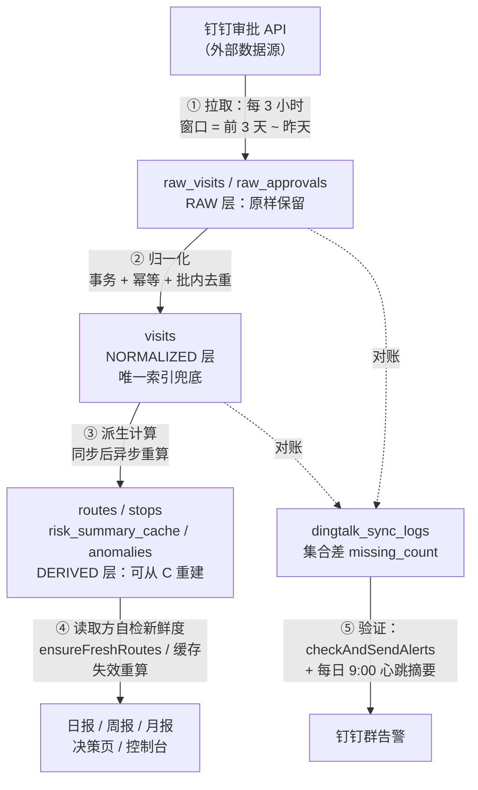
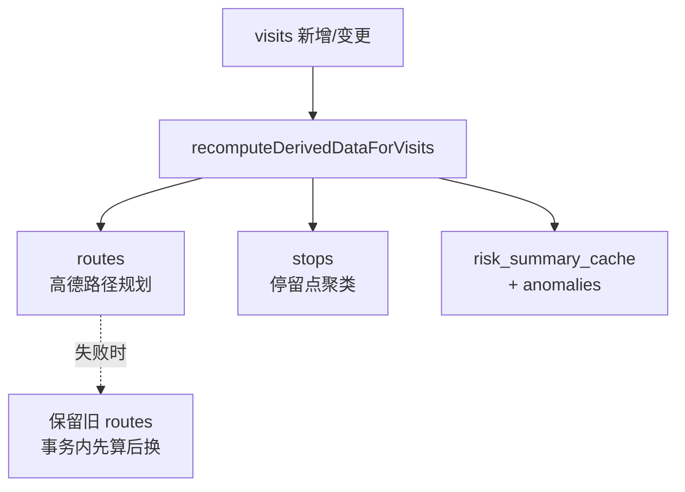
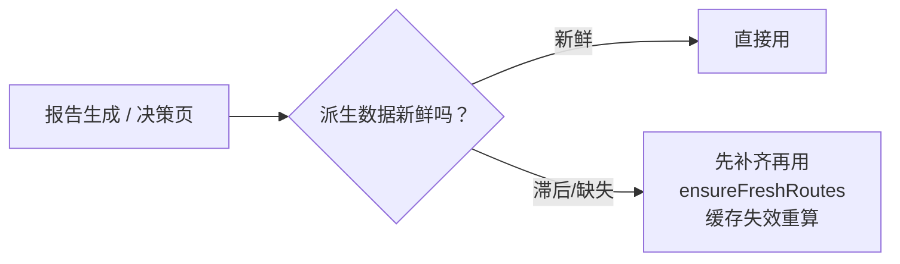
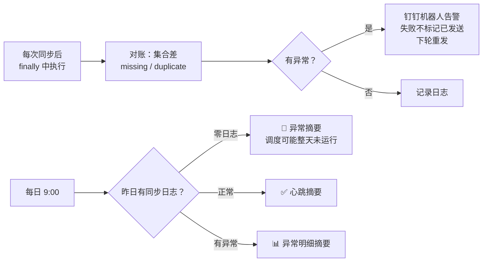

# 数据链路图解：从钉钉同步到最终验证

> 本文把系统的数据链路拆解为 5 个阶段，每个阶段对应一个 DDIA 概念、
> 一个设计时自查问题、一个本次事故（2026-08-03）的真实案例。
> 配合 `docs/incidents/2026-08-03-disk-full-postmortem.md` 阅读。

## 全链路总览

## 第一阶段：拉取（Extract）

- **DDIA 概念**：一切数据系统的起点是**不可变的事实源**（fact source）。RAW 层原样保留钉钉返回的 JSON，不加工、不丢弃——这样下游任何 bug 都可以通过重放 RAW 修复，而不必重新求助于外部 API（外部数据随时可能不可再得）。
- **自查问题**：*如果明天发现下游全算错了，我能不能不依赖钉钉、纯靠本地数据重算？*
- **事故案例**：重复签到清理后，7/8 的 routes/stops/风险缓存可以直接重算修复，因为 visits 还在；如果连 visits 都错了，还能回到 raw_approvals 重新归一化。
- **现状**：同步窗口「前 3 天 ~ 昨天」意味着钉钉侧 3 天内的补卡/修改都会被自动覆盖重拉。

## 第二阶段：归一化写入（Load）

- **DDIA 概念**：**幂等写入（idempotence）**。数据管道一定会被重跑（重试、catchup、手动触发、并发），「exactly-once」不靠运气，靠让重复写入无害。三层防御：批内去重 → 先查再插 → 唯一约束。前两层是性能优化，最后一层才是正确性保证。
- **自查问题**：*这段写入重跑一遍会怎样？两个同时跑会怎样？*
- **事故案例**：此前防重只有「先查再插」，并发同步双双通过检查 → 同一签到写两行且永久残留（线上清出 9 组）。现在唯一索引 `(approval_id, user_id, sequence)` 让数据库成为最终裁判。
- **另一个案例**：raw_visits 和 visits 原本分两条 INSERT 无事务，坏数据会让 raw_visits 每 3 小时膨胀一行孤儿数据——现在同一事务，失败整体回滚。

## 第三阶段：派生计算（Derive）

- **DDIA 概念**：**派生数据（derived data）**——DDIA 第三部分的核心。routes/stops/缓存/报告全部可从 visits 重建，因此它们「可以旧、可以缺，但必须能被发现并重建」。派生数据的管道一定会断（高德限流、进程重启、磁盘满），健壮性来自**可重放**，而不是来自祈祷管道不断。
- **自查问题**：*这个派生表断了/旧了/被清空了，谁会发现？怎么补回来？*
- **事故案例**：routes 重算原来是「先删后算、无事务」，高德失败即丢数据甚至清零；且 stops 只在有人打开控制台时才计算。现在：事务内先算后换、失败段保留旧数据、stops 纳入自动重算。
- **关键认知**：`visits` 是事实，`routes` 是观点。观点随时可以重新形成，事实必须寸步不让。

## 第四阶段：读取方自检（Self-healing Read）

- **DDIA 概念**：这是派生数据思想的落地形态——**把修复能力内建到读取路径**。「靠时序保证正确」（上游算好了我再读）是脆弱的；「读的时候自己校验补齐」才是自愈的。
- **自查问题**：*我读的这张表，凭什么相信它是最新的？*
- **事故案例**：日报里程长期与线上不一致，根因就是报告被动读 routes 表、生成时机与重算时机错位。现在报告生成前 `ensureFreshRoutes` 只补算脏组合；风险缓存读前校验 `updated_at >= max(visits.created_at)`，过期自动重算。
- **注意**：报告仍是**快照**——生成之后新到的补卡不会改变已发出的报告，这是快照语义，不是 bug。

## 第五阶段：验证与告警（Verify）

- **DDIA 概念**：**可观测性（observability）**。你不可能改进你看不见的东西。两个原则：①告警的发送本身也要可观测（发送失败不能静默吞掉）；②「没有信号」和「一切正常」必须可区分（所以要有心跳——每天收到 ✅ = 系统活着且正常；收不到 = 该来看了）。
- **自查问题**：*它坏了我会知道吗？多久之后知道？告警本身坏了我又会知道吗？*
- **事故案例**：8/3 凌晨数据库崩溃后，同步持续失败，但告警检查只在同步成功后执行 → 完全静默；且「昨日零日志」被判定为「无异常」。两个盲区都已堵上。
- **对账口径**：`missing_count` 用真实集合差（processed − db），库端按 approval_id 直查——计数差会被历史数据掩盖，口径不一致会制造误报疲劳，误报疲劳会掩盖真信号。

## 速查表：五个自查问题

| 阶段 | 自查问题 | DDIA 对应 |
|---|---|---|
| 拉取 | 下游全错了，能不依赖外部 API 重算吗？ | 不可变事实源 |
| 写入 | 重跑一遍会怎样？两个同时跑会怎样？ | 幂等性、事务 |
| 派生 | 管道断了/数据旧了，谁发现、怎么补？ | 派生数据可重放 |
| 读取 | 我凭什么相信这张表是最新的？ | 读路径自愈 |
| 验证 | 坏了我会知道吗？告警坏了呢？ | 可观测性、心跳 |

设计新功能时按这张表从上往下问一遍，绝大多数本次事故级别的问题都能提前暴露。
