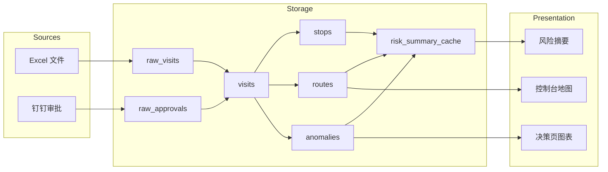

# 第 1 章：可靠性、可扩展性、可维护性

> 本章对应《Designing Data-Intensive Applications》（DDIA）第 1 章：Reliable, Scalable, and Maintainable Applications。书中把这三个词定义为数据系统的核心关切，本章笔记把它们映射到当前项目——销售外勤行为分析系统——的真实设计、代码和取舍上。

## 1. 数据密集型应用的本质

DDIA 开宗明义：现代很多应用本质上是**数据密集型（data-intensive）**，而非计算密集型。它们的核心挑战不是 CPU 算得不够快，而是：

- 数据量太大，怎么存、怎么取；
- 数据来自多个异构系统，怎么整合；
- 系统怎么在故障、扩容、人员变动中保持稳定。

本项目就是典型案例：数据来自 Excel 和钉钉审批两个完全不同的源，要存储原始记录、标准化记录、停留点、路径、异常、风险评分等多层数据，还要通过前端地图和图表实时展示。CPU 没做多少复杂数学运算，但数据流很长、状态很多、一致性问题很真实。



## 2. 可靠性（Reliability）

### 2.1 概念

可靠性指系统在面对**硬件故障、软件错误、人为失误**时，仍能按预期工作。注意：不是“永远不宕机”，而是“即使出故障，影响也可控、可恢复”。

DDIA 把故障分成几类：

- **硬件故障**：硬盘坏了、内存出错、网络抖动、服务器断电。
- **软件错误**：Bug、级联失败、依赖服务超时。
- **人为失误**：配置写错、误删数据、发布有问题的代码。

应对思路通常是：冗余、容错、快速恢复、测试、监控、最小权限。

### 2.2 本项目如何体现可靠性

#### 2.2.1 数据冗余：原始层保留，错了也能重来

项目中最关键的可靠性设计是：**永远保留原始数据**。`raw_visits` 和 `raw_approvals` 表几乎不做清洗，先把 Excel 和钉钉的原样内容存下来。这样即使标准化逻辑写错了，也可以从 RAW 层重新生成 `visits`。

建表逻辑在 [`backend/src/db.ts`](../../backend/src/db.ts:14-45) 中：

```sql
-- RAW 层：原始数据，完全保留导入来源
CREATE TABLE IF NOT EXISTS raw_visits (
  id SERIAL PRIMARY KEY,
  raw_user_name VARCHAR(128),
  raw_time TEXT,
  raw_location TEXT,
  raw_address TEXT,
  raw_lat TEXT,
  raw_lng TEXT,
  raw_customer_name VARCHAR(255),
  source VARCHAR(64) DEFAULT 'excel',
  created_at TIMESTAMPTZ DEFAULT NOW()
);

-- RAW 层：钉钉审批原始实例
CREATE TABLE IF NOT EXISTS raw_approvals (
  id SERIAL PRIMARY KEY,
  approval_id VARCHAR(64) UNIQUE NOT NULL,
  process_instance_id VARCHAR(64),
  process_code VARCHAR(64),
  title VARCHAR(255),
  originator_userid VARCHAR(64),
  originator_user_name VARCHAR(128),
  originator_dept_name VARCHAR(128),
  create_time TIMESTAMPTZ,
  finish_time TIMESTAMPTZ,
  form_json JSONB,
  result VARCHAR(32),
  status VARCHAR(32),
  source VARCHAR(64) DEFAULT 'dingtalk',
  created_at TIMESTAMPTZ DEFAULT NOW()
);
```

这是“写时复制”思想的简化版：原始数据一旦写入就不改，上层再怎么算，根还在。

#### 2.2.2 地理编码失败不阻断流程

地址转坐标是高德 Web API 调用，可能失败或没配 Key。项目在 [`backend/src/services/geocoding.ts`](../../backend/src/services/geocoding.ts) 中做了多层兜底：优先高德，失败时用内置坐标表加随机抖动。这样不会因为一个外部接口挂掉就导致整条导入失败。

> 对应 AGENTS.md 中的说明：无 Key 或失败时，使用内置城市/区县/省份近似坐标表并加随机抖动作为兜底。

#### 2.2.3 同步失败有日志、可追踪

钉钉同步不是“成功或失败”一句话，而是把全过程写入 [`dingtalk_sync_logs`](../../backend/src/db.ts:371-398) 表：

```sql
CREATE TABLE IF NOT EXISTS dingtalk_sync_logs (
  id SERIAL PRIMARY KEY,
  triggered_by VARCHAR(32) NOT NULL CHECK (triggered_by IN ('scheduler', 'manual', 'startup')),
  status VARCHAR(16) NOT NULL CHECK (status IN ('running', 'success', 'failed')),
  start_date DATE NOT NULL,
  end_date DATE NOT NULL,
  total_instances INTEGER NOT NULL DEFAULT 0,
  parsed_visits INTEGER NOT NULL DEFAULT 0,
  parse_failures INTEGER NOT NULL DEFAULT 0,
  normalized_inserted INTEGER NOT NULL DEFAULT 0,
  skipped INTEGER NOT NULL DEFAULT 0,
  error_message TEXT,
  started_at TIMESTAMPTZ DEFAULT NOW(),
  finished_at TIMESTAMPTZ
);
```

`status` 字段让运维一眼看出哪次同步失败；`error_message` 保留错误详情；`parse_failures` 记录部分解析失败的数量，说明系统允许“部分成功”——不是一失败就全部回滚，而是把能处理的留下，失败的单独排查。

#### 2.2.4 人为失误的防范：幂等初始化

数据库初始化用 `CREATE TABLE IF NOT EXISTS` 和 `ALTER TABLE ... ADD COLUMN IF NOT EXISTS`，见 [`backend/src/db.ts`](../../backend/src/db.ts:10-400)。这意味着：

- 重复运行不会报错；
- 老数据库可以增量升级；
- 不会因为运维同学多执行一次脚本就破坏数据。

这是“防御性设计”：假设操作的人会犯错，系统要保护数据。

#### 2.2.5 权限与异常豁免：人的决策也能被撤销

 [`backend/src/services/auth.ts`](../../backend/src/services/auth.ts) 和 [`backend/src/routes/feedback.ts`](../../backend/src/routes/feedback.ts) 实现了反馈申诉流程。员工可以对系统判定的异常提出申诉，审批通过后写入 `anomaly_exceptions` 表，但原异常记录不会被删除：

```sql
CREATE TABLE IF NOT EXISTS anomaly_exceptions (
  id SERIAL PRIMARY KEY,
  user_id VARCHAR(64) NOT NULL,
  start_date DATE NOT NULL,
  end_date DATE NOT NULL,
  feedback_id INTEGER REFERENCES feedback(id),
  created_at TIMESTAMPTZ DEFAULT NOW()
);
```

这体现了可靠性中的“可审计”：系统自动化判定可能出错，但人工复核路径被完整保留，且不会破坏原始数据。

## 3. 可扩展性（Scalability）

### 3.1 概念

可扩展性指系统在面对**负载增长**时，能否保持性能、不崩溃、成本合理。DDIA 强调：谈论可扩展性时必须明确“负载是什么”和“性能指标是什么”。

常见负载维度：

- **请求量**：每秒请求数（QPS）。
- **数据量**：存储的数据条数和大小。
- **复杂度**：查询是否需要跨大量数据聚合。
- **用户规模**：并发访问人数。

常见性能指标：

- **响应时间**：用户请求多久返回。
- **吞吐量**：单位时间处理多少请求或数据。
- **资源利用率**：CPU、内存、磁盘、网络用了多少。

### 3.2 本项目的负载特征

| 负载维度 | 当前特征 | 未来可能变化 |
|---|---|---|
| 请求量 | 内部管理工具，并发低 | 推广到全国分公司后并发增加 |
| 数据量 | 每日数万条 visit，量级可控 | 历史数据累积到千万级 |
| 复杂度 | 单日/单人聚合为主 | 月维度、跨部门多维分析 |
| 用户规模 | 管理层 + 销售员工 | 增加区域经理、HR、财务等角色 |

针对这些负载，项目做了以下可扩展性设计。

### 3.3 预计算缓存：用空间换时间

 [`backend/src/services/riskSummaryService.ts`](../../backend/src/services/riskSummaryService.ts) 中的 `risk_summary_cache` 表是关键优化。历史日期的风险摘要不实时计算，而是提前算好存起来：

```sql
CREATE TABLE IF NOT EXISTS risk_summary_cache (
  id SERIAL PRIMARY KEY,
  user_id VARCHAR(64) NOT NULL,
  user_name VARCHAR(128),
  department VARCHAR(128),
  date DATE NOT NULL,
  risk_score INTEGER NOT NULL DEFAULT 0,
  risk_level VARCHAR(16) NOT NULL DEFAULT 'low',
  anomaly_count INTEGER NOT NULL DEFAULT 0,
  high_anomaly_count INTEGER NOT NULL DEFAULT 0,
  medium_anomaly_count INTEGER NOT NULL DEFAULT 0,
  low_anomaly_count INTEGER NOT NULL DEFAULT 0,
  visit_count INTEGER NOT NULL DEFAULT 0,
  total_stop_minutes INTEGER NOT NULL DEFAULT 0,
  total_distance_km DOUBLE PRECISION NOT NULL DEFAULT 0,
  reasons JSONB DEFAULT '[]',
  created_at TIMESTAMPTZ DEFAULT NOW(),
  updated_at TIMESTAMPTZ DEFAULT NOW(),
  UNIQUE(user_id, date)
);
```

`UNIQUE(user_id, date)` 确保每人每天只有一行，前端查询决策页时直接读缓存，避免重复计算大量历史数据。定时任务在 [`backend/src/services/scheduler.ts`](../../backend/src/services/scheduler.ts:119-140) 中每天凌晨 2 点刷新昨天的缓存：

```typescript
export function startRiskSummaryCacheScheduler(): void {
  const runCacheJob = async () => {
    const yesterday = getYesterdayBeijing();
    console.log(`[Scheduler] Refreshing risk summary cache for ${yesterday}`);
    try {
      await persistRiskSummaryCache(yesterday, { useExistingRoutes: true });
      console.log(`[Scheduler] Risk summary cache refreshed for ${yesterday}`);
    } catch (err) {
      console.error(`[Scheduler] Failed to refresh risk summary cache:`, err);
    }
  };
  // ...
}
```

这是典型的“离线计算 + 在线查询”模式：复杂的聚合在后台完成，用户看到的接口只是读取结果。

### 3.4 索引：小改动，大收益

 [`backend/src/db.ts`](../../backend/src/db.ts:111-117) 中为 `visits` 表建立了复合索引：

```sql
CREATE INDEX IF NOT EXISTS idx_visits_user_time
  ON visits(user_id, timestamp);
CREATE INDEX IF NOT EXISTS idx_visits_user_business_date
  ON visits(user_id, business_date);
CREATE INDEX IF NOT EXISTS idx_visits_approval
  ON visits(approval_id, sequence);
```

这些索引直接对应前端最常用的查询模式：按员工查时间范围、按业务日期查、按审批单查。没有索引的话，数据量稍大就会全表扫描，查询慢到无法使用。

### 3.5 异步处理：钉钉同步不阻塞用户请求

钉钉同步是定时任务，在 [`backend/src/services/scheduler.ts`](../../backend/src/services/scheduler.ts:179-200) 中每 3 小时执行一次：

```typescript
async function syncLastNDays(n: number): Promise<void> {
  if (!isDingTalkConfigured()) return;
  // ...
  const result = await syncApprovals(dateToStartMs(startDate), dateToEndMs(endDate), "scheduler");
  // 同步完成后立即检查并发送告警
  try {
    const alerts = await checkAndSendAlerts();
    // ...
  }
}
```

同步过程可能持续数分钟，期间用户仍然可以查询已有数据。这是把“重活”和“快响应”分开，避免一个长任务拖垮接口。

### 3.6 扩展瓶颈：当前 PostgreSQL 一身兼两职

项目目前把所有数据都存在 PostgreSQL，既做 OLTP（写入原始数据）又做 OLAP（聚合查询）。这在数据量小时没问题，但如果：

- 历史数据累积到千万级；
- 开始做全国范围的实时热力图；
- 需要复杂的多维分析；

PostgreSQL 的聚合查询可能成为瓶颈。可能演进方向：

- 继续强化缓存层，把更多预计算结果放入 `risk_summary_cache`；
- 引入专门的 OLAP 或列式数据库做分析；
- 用 Superset 等 BI 工具替代前端直接跑复杂查询。

项目在 [`data-engineering-cheatsheet.md`](data-engineering-cheatsheet.md) 中已经提到 Superset 暂未接入，但预留了扩展思路。

## 4. 可维护性（Maintainability）

### 4.1 概念

DDIA 把可维护性拆成三个子维度：

- **可操作性（Operability）**：运维能否轻松监控系统、排查问题、日常维护。
- **简单性（Simplicity）**：系统是否容易理解，新人能否快速上手。
- **可演化性（Evolvability）**：系统能否方便地修改和扩展，以适应需求变化。

### 4.2 可操作性：日志、监控、告警

#### 4.2.1 同步健康告警

钉钉同步完成后，[`backend/src/services/syncCheckService.ts`](../../backend/src/services/syncCheckService.ts) 会对比源端和落库端的审批单 ID 集合：

```sql
ALTER TABLE dingtalk_sync_logs ADD COLUMN IF NOT EXISTS source_approval_ids_hash TEXT;
ALTER TABLE dingtalk_sync_logs ADD COLUMN IF NOT EXISTS db_approval_ids_hash TEXT;
ALTER TABLE dingtalk_sync_logs ADD COLUMN IF NOT EXISTS missing_count INTEGER NOT NULL DEFAULT 0;
ALTER TABLE dingtalk_sync_logs ADD COLUMN IF NOT EXISTS duplicate_count INTEGER NOT NULL DEFAULT 0;
ALTER TABLE dingtalk_sync_logs ADD COLUMN IF NOT EXISTS raw_visit_count INTEGER NOT NULL DEFAULT 0;
ALTER TABLE dingtalk_sync_logs ADD COLUMN IF NOT EXISTS alert_sent BOOLEAN NOT NULL DEFAULT false;
```

如果发现 `missing_count > 0` 或 `duplicate_count > 0`，说明同步有异常，可以通过 `DINGTALK_EXPORT_ROBOT_WEBHOOK` 发送机器人告警。这是可操作性的体现：不用人工每天查表，系统会主动报告问题。

#### 4.2.2 统一日志

项目中大量使用了 `console.log` / `console.error` 记录关键事件，例如 [`backend/src/services/scheduler.ts`](../../backend/src/services/scheduler.ts:121-128) 中：

```typescript
console.log(`[Scheduler] Refreshing risk summary cache for ${yesterday}`);
try {
  await persistRiskSummaryCache(yesterday, { useExistingRoutes: true });
  console.log(`[Scheduler] Risk summary cache refreshed for ${yesterday}`);
} catch (err) {
  console.error(`[Scheduler] Failed to refresh risk summary cache:`, err);
}
```

生产环境中这些日志通常会接入 ELK、Loki 或阿里云 SLS 等日志系统，方便按 `[Scheduler]` 等关键字检索。

### 4.3 简单性：分层、约定、单一职责

#### 4.3.1 数据分层让问题定位简单

RAW / NORMALIZED / DERIVED 三层已经在 [`AGENTS.md`](../../AGENTS.md) 和 [`backend/src/db.ts`](../../backend/src/db.ts) 中明确：


如果发现异常数量不对，可以分层排查：

1. 先看 RAW 层数据是否完整；
2. 再看 NORMALIZED 层 `visits` 是否正确；
3. 最后看 DERIVED 层 `anomalies` 的生成逻辑。

分层让“在哪一层出错”变得清晰，避免了所有逻辑混在一起无从下手。

#### 4.3.2 代码目录按职责划分

后端目录结构清晰：

- [`backend/src/routes/`](../../backend/src/routes/)：只接收请求、解析参数、返回响应。
- [`backend/src/services/`](../../backend/src/services/)：包含业务逻辑、外部 API 调用、数据计算。
- [`backend/src/utils/`](../../backend/src/utils/)：通用工具函数，如时区转换。
- [`backend/src/types.ts`](../../backend/src/types.ts)：集中类型定义。

例如路由文件 [`backend/src/routes/routes.ts`](../../backend/src/routes/routes.ts) 只负责调用 [`backend/src/services/routeService.ts`](../../backend/src/services/routeService.ts) 中的 `computeAndPersistRoutes`，复杂的路径规划逻辑在 `routeService` 和 `routePlanning` 中。这样路由文件很短，业务逻辑可复用、可测试。

#### 4.3.3 时间处理统一到一个工具

项目反复强调按北京时间处理业务日期。所有时间转换集中在 [`backend/src/utils/timezone.ts`](../../backend/src/utils/timezone.ts) 中，而不是散落在每个路由里。这避免了“这里用 UTC、那里用本地时间”的低级错误。

### 4.4 可演化性：schema 变更不推倒重来

数据库没有独立迁移框架，但通过 `IF NOT EXISTS` 和 `ADD COLUMN IF NOT EXISTS` 实现了增量演化。例如 `visits` 表从最初的几列逐渐扩展了 `approval_id`、`trip_type`、`vehicle`、`reported_distance_km` 等字段：

```sql
ALTER TABLE visits ADD COLUMN IF NOT EXISTS approval_id VARCHAR(64);
ALTER TABLE visits ADD COLUMN IF NOT EXISTS approval_status VARCHAR(32);
ALTER TABLE visits ADD COLUMN IF NOT EXISTS sequence INTEGER DEFAULT 0;
ALTER TABLE visits ADD COLUMN IF NOT EXISTS trip_type VARCHAR(64);
ALTER TABLE visits ADD COLUMN IF NOT EXISTS vehicle VARCHAR(128);
ALTER TABLE visits ADD COLUMN IF NOT EXISTS start_odometer DOUBLE PRECISION;
ALTER TABLE visits ADD COLUMN IF NOT EXISTS end_odometer DOUBLE PRECISION;
ALTER TABLE visits ADD COLUMN IF NOT EXISTS reported_distance_km DOUBLE PRECISION;
ALTER TABLE visits ADD COLUMN IF NOT EXISTS cumulative_mileage_km DOUBLE PRECISION;
ALTER TABLE visits ADD COLUMN IF NOT EXISTS visit_note TEXT;
ALTER TABLE visits ADD COLUMN IF NOT EXISTS special_sign_reason TEXT;
ALTER TABLE visits ADD COLUMN IF NOT EXISTS photos JSONB DEFAULT '[]';
ALTER TABLE visits ADD COLUMN IF NOT EXISTS geocode_status VARCHAR(16) DEFAULT 'pending';
ALTER TABLE visits ADD COLUMN IF NOT EXISTS source_detail VARCHAR(64);
ALTER TABLE visits ADD COLUMN IF NOT EXISTS business_date DATE;
```

见 [`backend/src/db.ts`](../../backend/src/db.ts:77-91)。这种设计让系统可以“边走边长”：新需求来了加字段，不需要停机重建表。

异常规则也做成了可配置表 [`anomaly_weights`](../../backend/src/db.ts:288-329)，而不是硬编码在代码里。业务规则变化时，改表里的 `weight` 或 `enabled`，不用改代码、不用重新部署。

### 4.5 一个可维护性上的不足：权限系统尚未收口

 [`AGENTS.md`](../../AGENTS.md) 中明确提到：

> 权限系统框架已完成，但大量核心业务接口（`/analytics/*`、`/visits/*` 等）尚未按角色过滤数据。

这意味着当前任何人只要知道用户 ID，就可以通过 `X-User-Id` header 模拟其他用户查看数据。这是可维护性中的一个债务：功能已经跑通，但安全边界没完全建好。后续演进需要把这些接口逐个收口，用 [`backend/src/services/auth.ts`](../../backend/src/services/auth.ts) 中的权限逻辑统一过滤。

## 5. 总结：三个维度如何互相影响

| 维度 | 本项目的关键设计 | 如果做不好会怎样 |
|---|---|---|
| 可靠性 | 保留 RAW 层、地理编码兜底、同步日志、幂等初始化、申诉流程 | 一旦算法出错，无法回滚；外部 API 一挂，全系统停；误操作导致数据丢失 |
| 可扩展性 | 风险摘要缓存、数据库索引、异步同步、分层计算 | 数据量增长后查询慢、同步阻塞用户、全表扫描拖垮数据库 |
| 可维护性 | 分层架构、职责分离、统一工具、可配置规则、schema 增量演化 | 新人难以接手、每次改需求都要大改、排查问题无从下手 |

DDIA 第 1 章的最终结论是：好的数据系统不是把某个指标做到极致，而是在可靠性、可扩展性、可维护性之间取得平衡。本项目也体现了这种平衡：它不是最前卫的架构，但用清晰的分层、缓存和配置化规则，把一个复杂的数据流管理得井井有条。

## 6. 延伸阅读

- 数据工程名词速查：[`data-engineering-cheatsheet.md`](data-engineering-cheatsheet.md)
- 项目部署与架构：[`DEPLOY.md`](../../DEPLOY.md)
- 开发计划：[`PLAN.md`](../../PLAN.md)
- 项目规范：[`AGENTS.md`](../../AGENTS.md)
