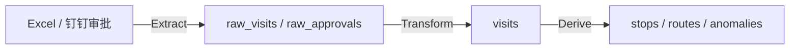
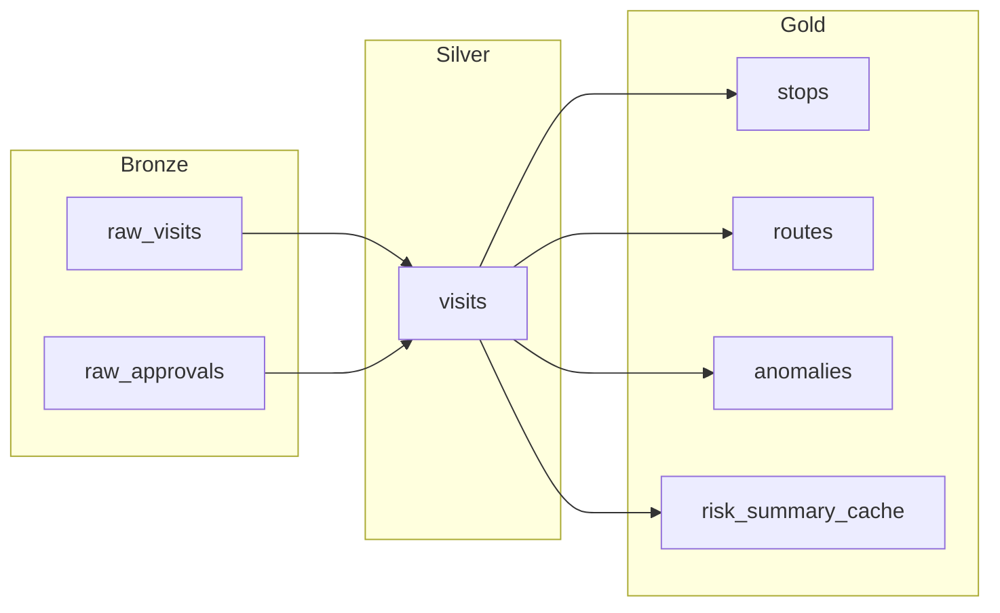

# 数据工程名词速查：用项目代码做对照

> 本文面向非科班读者，把数据工程中最常听到的名词用当前项目——销售外勤行为分析系统——的代码和流程讲清楚。你可以把它当成“听到一个词后快速回来看”的速查表。

## 目录

- [数据工程名词速查：用项目代码做对照](#数据工程名词速查用项目代码做对照)
  - [目录](#目录)
  - [ETL / ELT](#etl--elt)
    - [概念](#概念)
    - [本项目对照](#本项目对照)
  - [checkSum / 数据校验](#checksum--数据校验)
    - [概念](#概念-1)
    - [本项目对照](#本项目对照-1)
  - [Superset](#superset)
    - [概念](#概念-2)
    - [本项目对照](#本项目对照-2)
  - [数据仓库分层](#数据仓库分层)
    - [概念](#概念-3)
    - [本项目对照](#本项目对照-3)
  - [Medallion Architecture](#medallion-architecture)
    - [概念](#概念-4)
    - [本项目对照](#本项目对照-4)
  - [其他相关名词](#其他相关名词)
    - [数据血缘（Data Lineage）](#数据血缘data-lineage)
    - [维度建模（Dimensional Modeling）](#维度建模dimensional-modeling)
    - [CDC（Change Data Capture）](#cdcchange-data-capture)
    - [OLAP / OLTP](#olap--oltp)
  - [一句话总结](#一句话总结)

---

## ETL / ELT

### 概念

ETL 是 **Extract（抽取）- Transform（转换）- Load（加载）** 的缩写，指把数据从源系统搬出来、清洗干净、再存进目标系统。ELT 只是把顺序调换：先加载到目标系统，再在里面做转换。

形象一点：ETL 是“在厨房洗完菜再端上桌”；ELT 是“先把菜运到餐厅，再在餐厅厨房里洗”。

- **ETL**：转换逻辑在独立中间层完成，目标库只放干净结果。适合数据量不大、清洗规则复杂的场景。
- **ELT**：先把原始数据一股脑倒进目标系统（通常是数据仓库），再利用仓库的算力做转换。适合数据量大、 schema 经常变的场景。

### 本项目对照

本项目是混合形态：

1. **Extract**：从两个源头抽取数据
   - Excel 文件：通过 [`backend/src/routes/upload.ts`](../../backend/src/routes/upload.ts) 接收上传，[`backend/src/services/excelParser.ts`](../../backend/src/services/excelParser.ts) 解析。
   - 钉钉审批：通过 [`backend/src/services/dingtalk.ts`](../../backend/src/services/dingtalk.ts) 调用钉钉 OpenAPI，把审批实例拉回来。

2. **Load**：先原样写入原始层
   - Excel 数据写入 `raw_visits` 表。
   - 钉钉数据写入 `raw_approvals` 表。
   - 建表逻辑见 [`backend/src/db.ts`](../../backend/src/db.ts)。这一步就是“先加载”。

3. **Transform**：再清洗成标准化层
   - [`backend/src/services/normalization.ts`](../../backend/src/services/normalization.ts) 把 `raw_visits` / `raw_approvals` 转换成 `visits` 表。
   - 转换内容包括：统一时间格式、按北京时间计算业务日期 [`business_date`](../../backend/src/utils/businessPeriod.ts)、规范化地址和经纬度、部门别名映射等。

所以严格来说，本项目更像 **ELT**：先加载原始数据，再在后端做转换。

---

## checkSum / 数据校验

### 概念

checkSum（校验和）是一种用短字符串验证数据完整性的方法。它像快递单号：你拿到包裹后扫一下单号，就知道包裹在运输过程中有没有被拆包或替换。

数据校验的范畴更大，包括：

- **行数校验**：源系统有 1000 条，目标系统也得有 1000 条。
- **内容校验**：关键字段之和是否一致。
- **唯一性校验**：有没有重复主键。
- **MD5 / SHA 校验**：把整个文件或集合算出一个 hash，对比两端是否一致。

### 本项目对照

钉钉同步完成后会做一次完整性校验，记录在 `dingtalk_sync_logs` 表中。核心逻辑在 [`backend/src/services/syncCheckService.ts`](../../backend/src/services/syncCheckService.ts) 中：

- `source_approval_ids_hash`：源端（钉钉）审批单 ID 集合的 MD5 hash。
- `db_approval_ids_hash`：落库后 `visits` 中对应审批单 ID 集合的 MD5 hash。
- `missing_count`：解析成功但库中缺失的审批单数。
- `duplicate_count`：库中 `approval_id + user_id + sequence` 重复记录数。
- `raw_visit_count`：本次同步写入 `raw_visits` 的数量。
- `alert_sent`：是否已发送告警。

这就是 checkSum 思想的真实应用：把两端数据集合转成 hash，发现不一致就说明同步过程丢了或重了数据。若校验失败，[`backend/src/services/scheduler.ts`](../../backend/src/services/scheduler.ts) 中配置的定时任务会触发告警机器人。

---

## Superset

### 概念

Apache Superset 是一个开源的 BI（商业智能）可视化工具，类似 Tableau、Metabase、Power BI。你可以用它连接数据库，拖拽生成图表和看板，再把看板分享给业务同事。

Superset 通常与数据仓库配合使用：仓库负责存储和计算，Superset 负责查询和展示。

### 本项目对照

本项目目前并没有接入 Superset。项目中的可视化由前端直接完成：

- 决策页：[`frontend/src/pages/DecisionPage.tsx`](../../frontend/src/pages/DecisionPage.tsx)
- 趋势图表组件：[`frontend/src/components/CompanyTrendChart.tsx`](../../frontend/src/components/CompanyTrendChart.tsx)、[`frontend/src/components/VisitCountTrendChart.tsx`](../../frontend/src/components/VisitCountTrendChart.tsx)
- 地图组件：[`frontend/src/components/MapContainer.tsx`](../../frontend/src/components/MapContainer.tsx)、[`frontend/src/components/HeatMapContainer.tsx`](../../frontend/src/components/HeatMapContainer.tsx)

这些前端图表直接调用后端接口（封装在 [`frontend/src/api.ts`](../../frontend/src/api.ts)），而不是通过 BI 工具中转。

> 如果未来数据量继续增大、分析需求更复杂，可以考虑把聚合结果写到一张宽表，再接入 Superset 做自助分析。这相当于把“分析层”和“展示层”解耦。

---

## 数据仓库分层

### 概念

数据仓库不是一个大表，而是按数据清洗程度分成多层。常见分层：

| 层级 | 英文名 | 说明 |
|---|---|---|
| 原始数据层 | ODS（Operational Data Store） | 原样保存业务系统数据，几乎不做清洗 |
| 明细数据层 | DWD（Data Warehouse Detail） | 清洗后的原子级明细，一行代表一个业务事件 |
| 汇总数据层 | DWS（Data Warehouse Summary） | 按主题聚合，如“每人每天”的汇总指标 |
| 应用数据层 | ADS / APP | 面向具体报表或接口的宽表 |

这种分层的好处是：

- 原始数据可追溯；
- 中间层可复用；
- 上层应用改动不会污染底层数据。

### 本项目对照

[`AGENTS.md`](../../AGENTS.md) 明确把数据分为 RAW / NORMALIZED / DERIVED 三层，虽然没叫 ODS/DWD/DWS，但思想完全一致：

| 层级 | 对应表 | 说明 |
|---|---|---|
| RAW | `raw_visits`、`raw_approvals` | 完全保留 Excel 或钉钉审批原始数据 |
| NORMALIZED | `visits` | 标准化后的拜访记录 |
| DERIVED | `stops`、`routes`、`anomalies` | 分析计算结果：停留点、路径段、异常事件 |
| 缓存/配置 | `risk_summary_cache`、`anomaly_weights` | 预计算缓存、异常规则 |

对应关系：

- RAW ≈ ODS
- NORMALIZED ≈ DWD
- DERIVED + 缓存 ≈ DWS / ADS

> 注意：本项目不是完整的数据仓库，而是业务系统内部的轻量级分层。但概念上是相通的。

---

## Medallion Architecture

### 概念

Medallion Architecture（奖章架构）是 Databricks 提出的数据湖分层思想，把数据分成三层，分别用铜、银、金比喻：

| 层级 | 英文名 | 数据质量 | 用途 |
|---|---|---|---|
| Bronze | 铜层 | 原始、未清洗 | 数据湖入口，保留所有历史痕迹 |
| Silver | 银层 | 清洗、去重、标准化 | 可直接用于分析 |
| Gold | 金层 | 高度聚合、面向业务 | 报表、BI、机器学习 |

它和数据仓库分层的最大区别是：奖章架构通常运行在数据湖（Data Lake）或 Lakehouse 上，强调先存所有原始数据，再按需提升质量；而传统数据仓库分层更强调结构化 schema。

### 本项目对照

如果把本项目的 PostgreSQL 表映射到奖章架构：

- **Bronze（铜层）**：`raw_visits`、`raw_approvals`。
  - 对应代码：[`backend/src/services/excelParser.ts`](../../backend/src/services/excelParser.ts) 和 [`backend/src/services/dingtalk.ts`](../../backend/src/services/dingtalk.ts)。
- **Silver（银层）**：`visits`。
  - 对应代码：[`backend/src/services/normalization.ts`](../../backend/src/services/normalization.ts)。
- **Gold（金层）**：`stops`、`routes`、`anomalies`、`risk_summary_cache`，以及前端展示用的接口返回。
  - 对应代码：[`backend/src/services/stopDetection.ts`](../../backend/src/services/stopDetection.ts)、[`backend/src/services/routeService.ts`](../../backend/src/services/routeService.ts)、[`backend/src/services/anomalyDetection.ts`](../../backend/src/services/anomalyDetection.ts)、[`backend/src/services/riskSummaryService.ts`](../../backend/src/services/riskSummaryService.ts)。

---

## 其他相关名词

### 数据血缘（Data Lineage）

指数据从哪来、经过哪些处理、到哪去的“家谱”。比如 `risk_summary_cache` 表的数据来自 `visits` → `anomalies` → 聚合。数据血缘对排错和审计非常重要。本项目目前没有自动血缘工具，但 [`AGENTS.md`](../../AGENTS.md) 中的分层说明已经手工画出了主要血缘。

### 维度建模（Dimensional Modeling）

数据仓库里一种设计表的方法：把事实（如“一次拜访”）和维度（如“员工”“日期”“部门”）分开。本项目尚未严格按维度建模，但 `visits` 表中已经包含 `user_id`、`business_date`、`department` 等天然维度字段，未来可以扩展出独立的维度表。

### CDC（Change Data Capture）

捕获源系统数据变化的技术。本项目同步钉钉审批时不是真正的 CDC，而是定时拉取（每 3 小时一次），见 [`backend/src/services/scheduler.ts`](../../backend/src/services/scheduler.ts)。真正的 CDC 需要数据库 binlog 或消息队列支持，钉钉端通常提供回调或事件推送。

### OLAP / OLTP

- **OLTP（Online Transaction Processing）**：面向单笔事务，强调写入快、一致性高。例如钉钉审批系统本身。
- **OLAP（Online Analytical Processing）**：面向批量分析，强调读聚合快。例如本项目的决策页、排行榜、风险摘要。

本项目后端 PostgreSQL 目前同时承担了一部分 OLTP（写入原始数据）和 OLAP（聚合查询）工作。如果分析查询变重，可以考虑把聚合结果预计算到 `risk_summary_cache`，或引入专门的 OLAP 引擎。

---

## 一句话总结

数据工程不是新魔法，而是“把数据从各处搬过来、洗干净、分层放好、再变成人能看懂的图表”。本项目从 Excel/钉钉抽取原始数据，经过标准化、分析计算，最终生成停留点、路径、异常、风险评分，正是一条完整的 ELT + 分层数据流水线。
